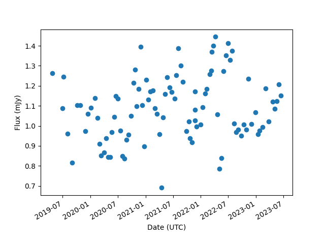

# How to use

The command line interface can be used to interact with the various database objects (also known as tables).
The first arguments is the object name and the second is the action.
For example if I wanted to list all observations of pulsar J1652-4838 I could use:

```
psrdb observation list --pulsar J1652-4838
```

If you're unsure which arguments you require you can use `-h` to list your options
or look at the [Command Line Interface](cli) documentation page.

Most database objects only have a `list` command but others (such as `toa` and `pulsar_fold_result`) also have a `download` command
which will download data from the tables to a csv.


## Pulsar Fold Result Download Example

For example the `pulsar_fold_result` table contains the processing results such as the flux density,
the dispersion measure, the rotation measure signal to noise of each observation.
You can download the results for a given pulsar using:

```
psrdb pulsar_fold_result download J1652-4838
```

Which will download the results to a csv file called `pulsar_fold_result_J1652-4838.csv` in the current directory that contains data that looks like:

```
ID,UTC Start,Observing band,Duration (s),DM (pc cm^-3),DM error (pc cm^-3),DM epoch (MJD),DM chi2r,DM tres,SN,Flux (mJy),RM (rad m^-2),RM error (rad m^-2),RFI zapped (%)
UHVsc2FyRm9sZFJlc3VsdE5vZGU6Mjkx,2023-06-16T17:12:10+00:00,LBAND,863.54886459813,188.17506533670348,0.0030674779606059722,59000.0,5.9886,5.9886,190.378768920898,1.151,-29.451,0.63,0.09469918224299065
UHVsc2FyRm9sZFJlc3VsdE5vZGU6NDI0,2021-01-19T06:13:30+00:00,LBAND,1135.5898640747655,188.16665101512618,0.0033251138173515647,59000.0,7.2091,7.2091,226.744201660156,1.131,-33.6916,0.15,0.10732491134751773
UHVsc2FyRm9sZFJlc3VsdE5vZGU6OTY0,2020-02-02T04:50:36+00:00,LBAND,1242.5246983177572,188.1714516981729,0.0030512582494712425,59000.0,5.6147,5.6147,224.331237792969,1.139,-42.526,0.34,0.06804886923421406
...
```

[Pandas](https://pandas.pydata.org/docs/) is an excellent tool for filtering and analysising this data.
For example, say you wanted to plot the flux density against the date for all bring observations in LBAND you could do the following:

```
import pandas as pd
import matplotlib.pyplot as plt

# Read your data into a Pandas DataFrame
df = pd.read_csv('pulsar_fold_result_J1652-4838.csv')

# Filter the data to only include LBAND observations
df = df[df['Observing band'] == 'LBAND']
# Filter the data to only include bright observations
df = df[df['SN'] > 20]


# Create a line plot
x = pd.to_datetime(df['UTC Start'])
y = df['Flux (mJy)']
plt.scatter(x, y)

# Add labels and a title
plt.xlabel('Date (UTC)')
plt.ylabel('Flux (mJy)')
plt.gcf().autofmt_xdate()
plt.savefig('J1652-4838_flux.png')
```

Which would make a plot like this:



Which is not quite ready for publication but is a good starting point.


## ToA Download Example

The `toa` table contains the times of arrival for each observation.
The ToAs can be generated a number of ways so to make sure you only download the ToAs you require,
you must use the following options:

- `--project`: the project short name (PTA, TPA, RelBin and GC), uses the ephemeris and template from the [private repository](https://ozgrav.github.io/meerkat_pulsar_docs/ephem_template/)
- `--nchan`: number of frequency channels. 1, 16, 32, 58, 116 and 928 are the currently processed options
- `--npol`: 1 for summed polarisations or 4 for full Stokes
- `--nsub_type`: either "1", "max", "mode" or "all" which are methods to calculate the number of nsubs explained [here](https://ozgrav.github.io/meerkat_pulsar_docs/ozstar_storage/#nsub-types)


For example if you wanted ToAs that use the PTA ephemeris and templates and has a single frequency channel, a single nsub, and summed polarisations, you could use:

```
psrdb toa download J1652-4838 --project PTA --nchan 1 --npol 1 --nsub_type 1
```

Which will download a `toa_J1652-4838_PTA_1_nsub_nchan1_npol1.tim` file that is ready to be used by pulsar tools such as `tempo2`.